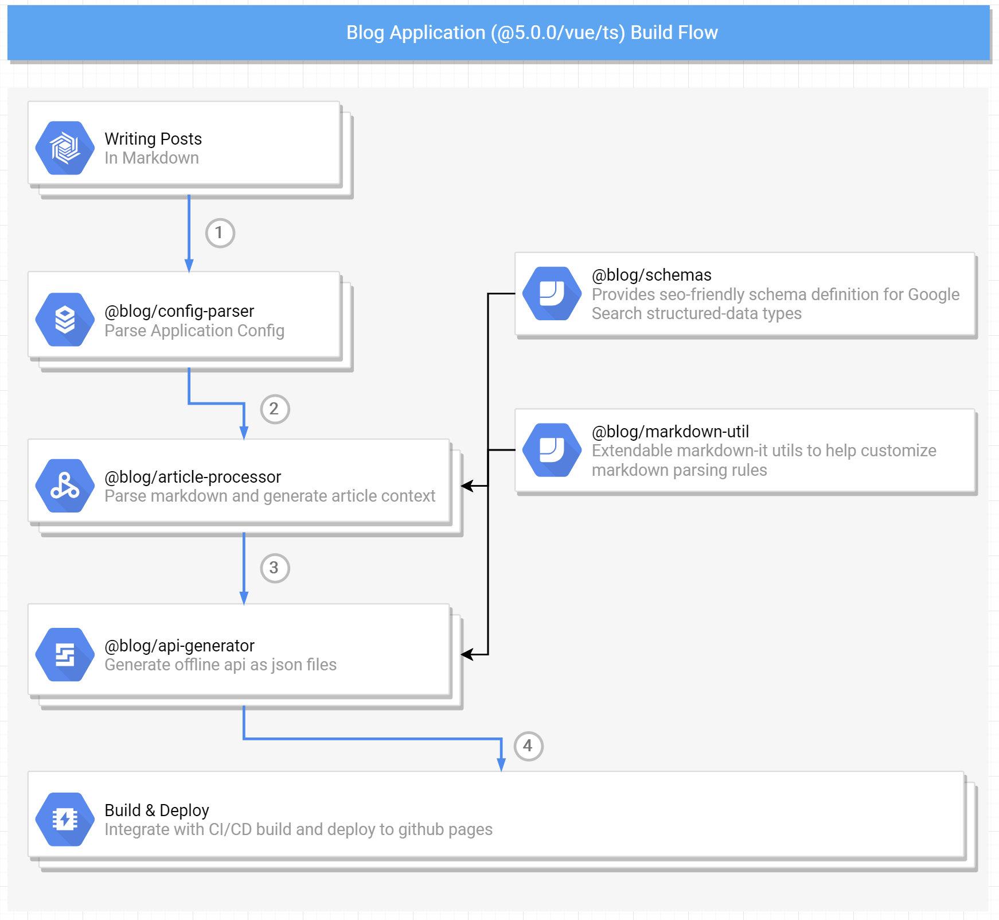

# blog.aquariuslt.com

Personal Blog

> For existing source of [https://blog.aquariuslt.com](https://blog.aquariuslt.com)

## Product Level Features

> TODO

## Development Level Features

- [x] TypeScript (application level code only use `*.ts`)
- [x] MultiPackages Management (with the help of `yarn workspace` and `lerna`)
- [ ] Google Search Structured Data Support 
- [x] RSS support
- [x] Integration with Github Actions

## Build Flow

## Road Map

> TODO
