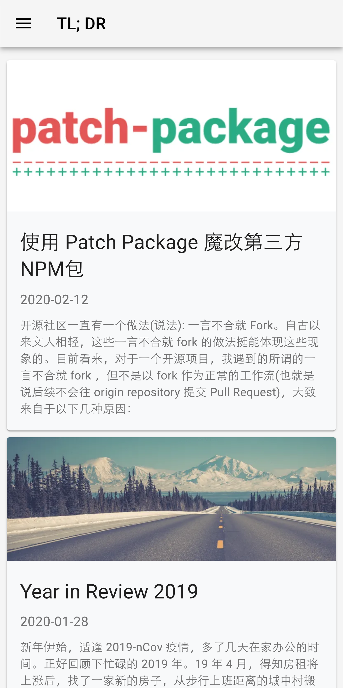
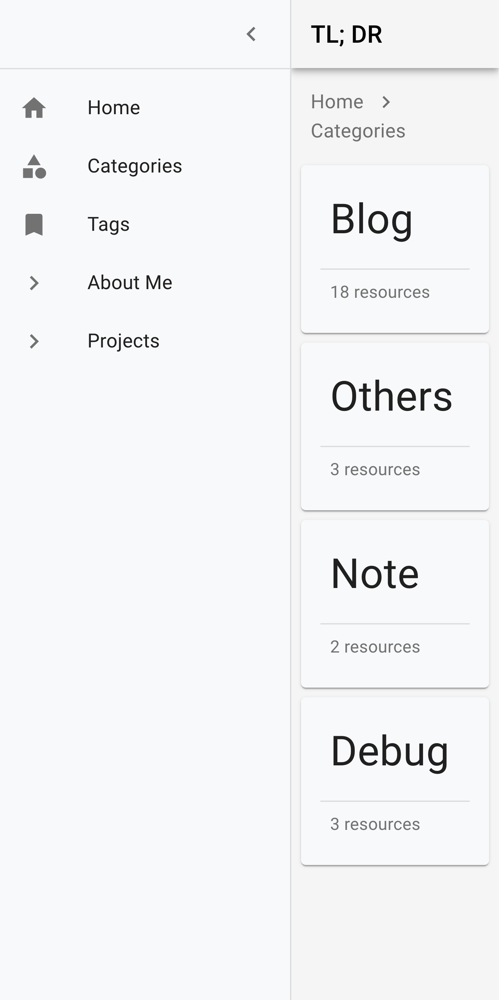
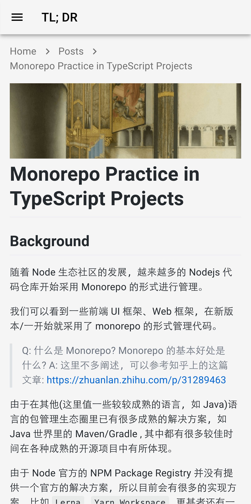
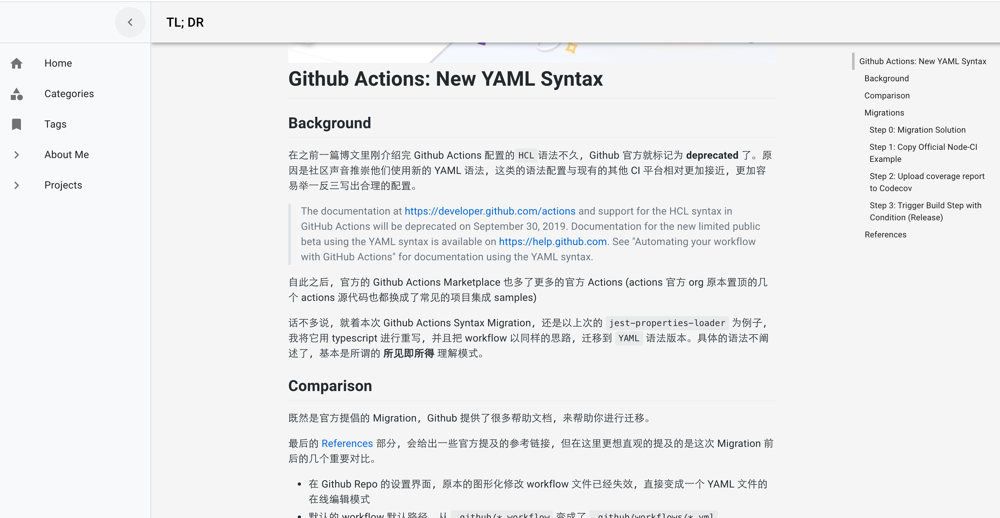
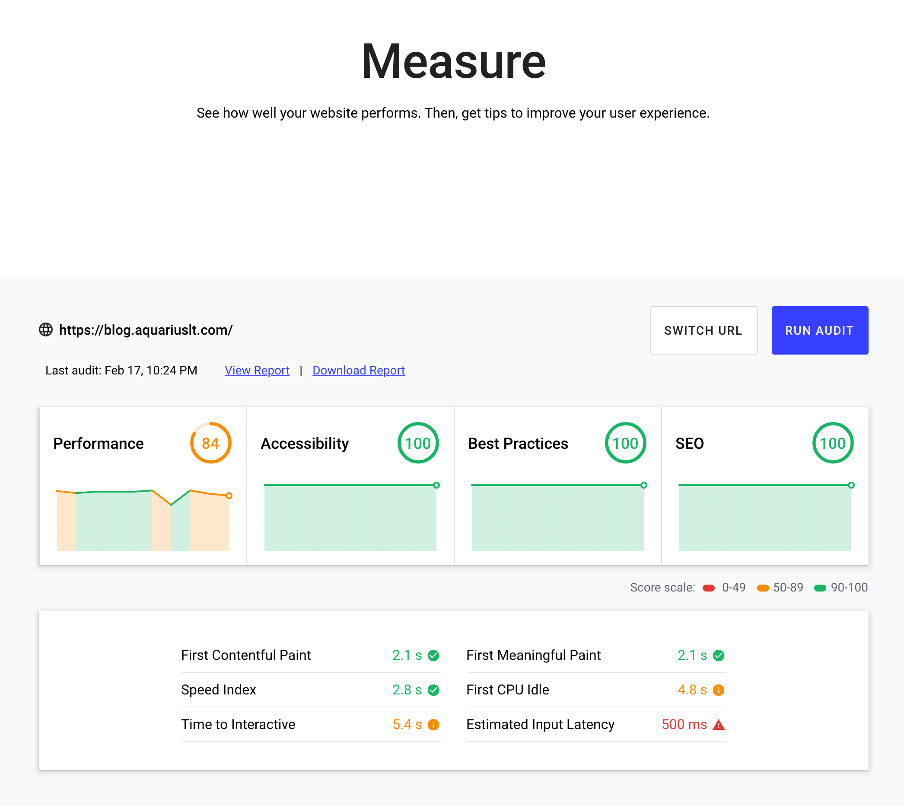
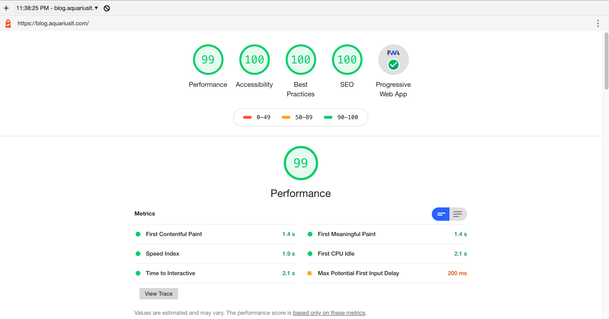

# zexo.dev

      

[https://zexo.dev](https://zexo.dev)

> Write Posts, Build Blog Application

This repo contains source code of my blog and posts.

## Screenshots

### Mobile

### Desktop

## Benchmark

### Web.dev Testing

### Local Lighthouse Score

## Change Log

See [CHANGELOG.md](./CHANGELOG.md) or [Github Releases](https://github.com/aquariuslt/blog/releases)
