# 蜗居

## 前言

毕业差不多有一年了,毕业时候租的一年的房子也到期了.  
适逢有同事已经住到 15 年新建好的唐家人才公寓那边,那边房子环境不错,打听到详细情况后,发现最吸引我的还是里面两点:

> 1. 里面没有家具,需要自己购置
> 2. 合同是跟华发物业签而非个人房东

这两点真的是太适合我了,一方面是租房合同可以随时终止,而且不用跟各种恶毒的个人房东打交道,二是新交的房子没有家具. 就不用担心租到不合适的房子看到家具风格不搭心里长草.

从提交申请,审核,到正式通知抽签选房,签合同入住大概经历了快三个月.  
三月初提交的申请,劳动节之后终于通知下来去抽签.

一层的户型图大概如下图: 从结构上分,个人申请只能申请一房一厅或者单身公寓了.  
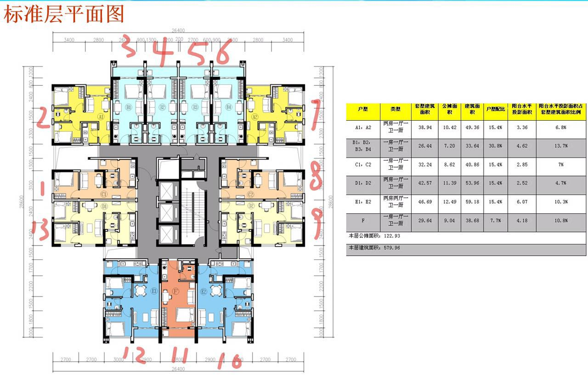 抽到了个 08 户型,一房一厅,实用面积才 30 多.

## 布置

### 空无一物的房间

签完合同刚拿到房子的时候,房间里面除了空调和稍微有点像样的厨房灶台之后,其他空无一物,显得比较空洞.  
大概是这样子的:

#### 空洞的过道

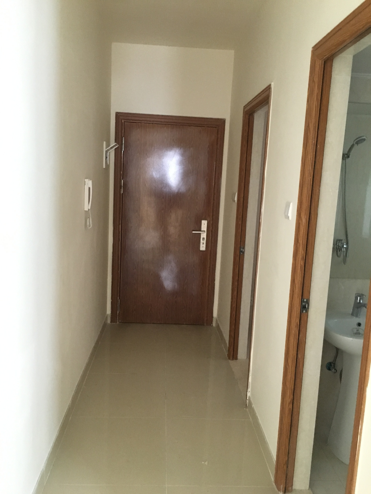

#### 空洞的客厅

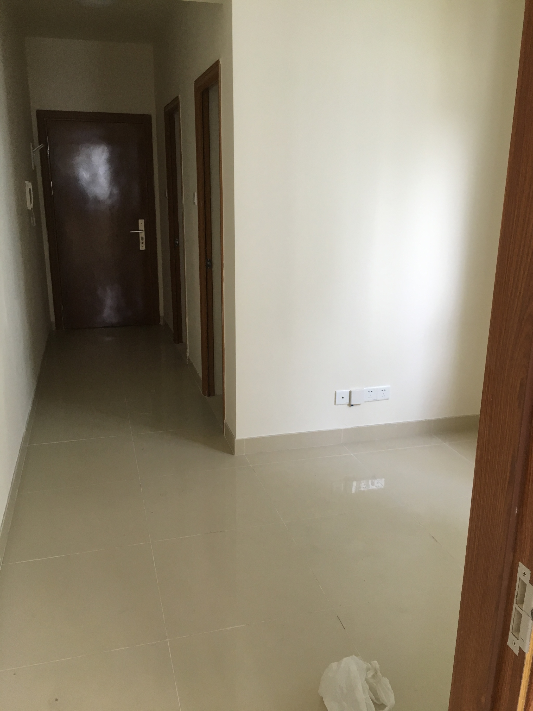

#### 空洞的睡房

#### 空洞的厨房

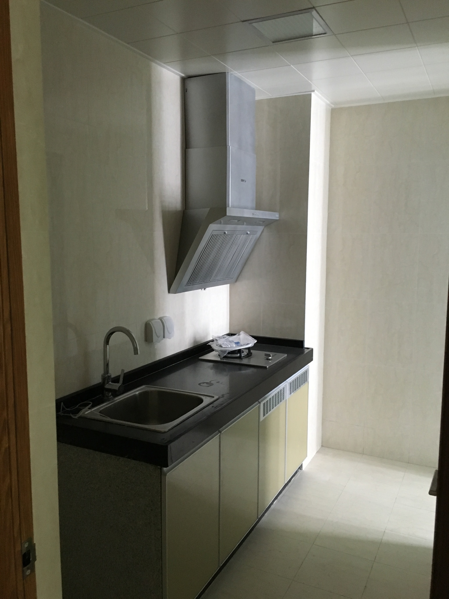

#### 空洞的阳台

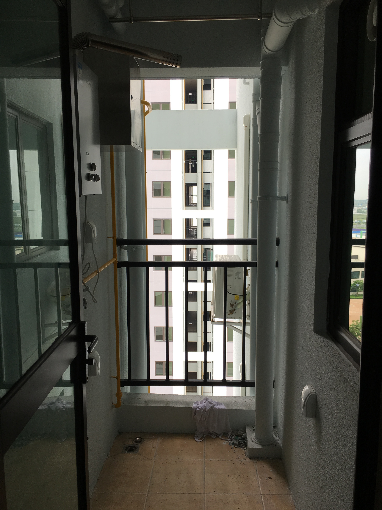

### 购置刚需家具

距离之前租的房子大概还有半个月到期,购置刚需家具就成了午休时间的任务.  
由于我已经有一张黑胡桃色的电脑桌,所以整体的家具都选用棕色/黑胡桃色吧.  
根据刚需的优先级,大概列了一下:

> 拐角电脑桌 >= 床 > 电脑椅 >> 书柜 >> 衣柜

家电的话,大概就只有

> 洗衣机 >> 电饭煲

### 安装与布置

陆续请了几个半天年假去办妥水电网络等各种开通手续之后,床和拐角电脑桌也送到了. 花了一个下午才把他们装好. 接着爸妈给我送来了窗帘和碗碟,还有一些大大小小的厨具~

五月下旬住进去之后一直没有买书柜和室内的晾衣架,直到前几天才送到,感觉现在就差个舒适的床垫就完美了~

下面是上图时间:

#### 大门过道就加了一个垫子

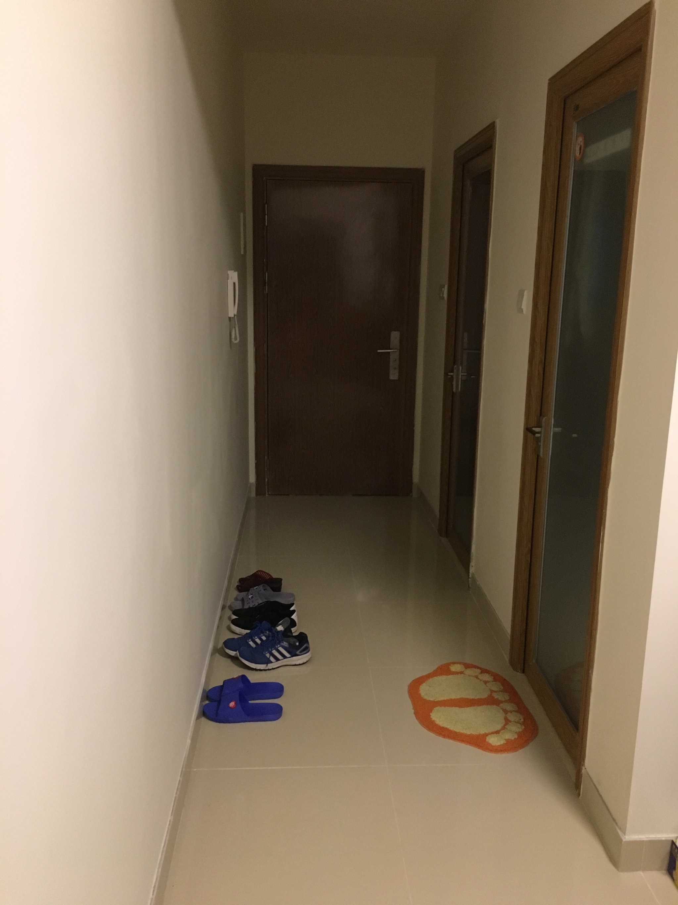

#### 只有骨架的电脑桌

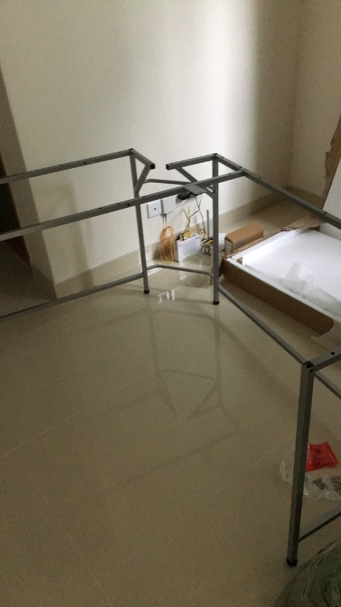

#### 上百螺丝还要反过来装

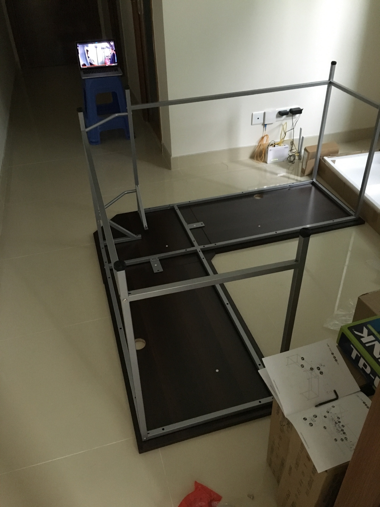

#### 安装完毕 配上西昊 M18 P2415Q+2414H 强 无敌

#### 原来的电脑桌变成了饭桌

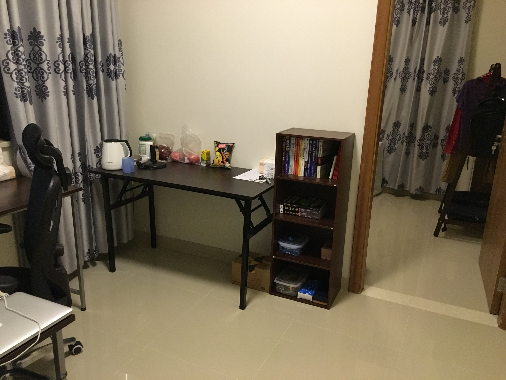

#### 室内衣架和一个杂物柜

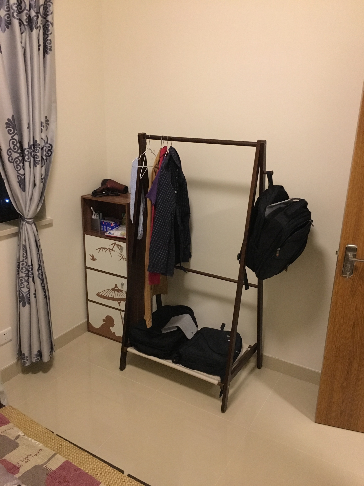

#### 低到类似榻榻米的床与床头柜

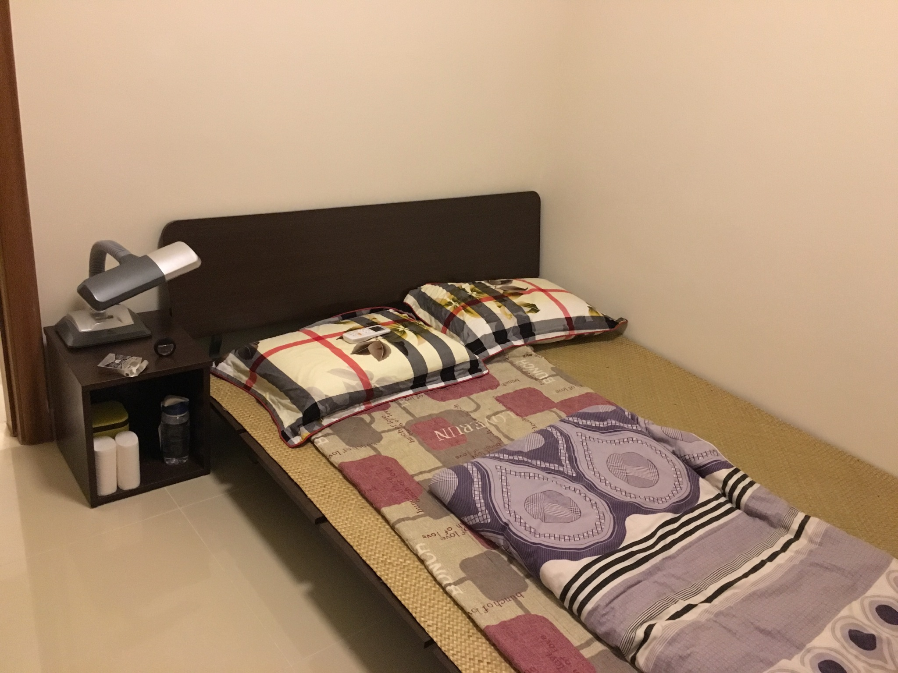

#### 楼再高一点就是海景啦

## 憧憬

配置齐全 感觉每天晚上专注 ~~学习~~ 的时间变长了. `wakatime`的 report 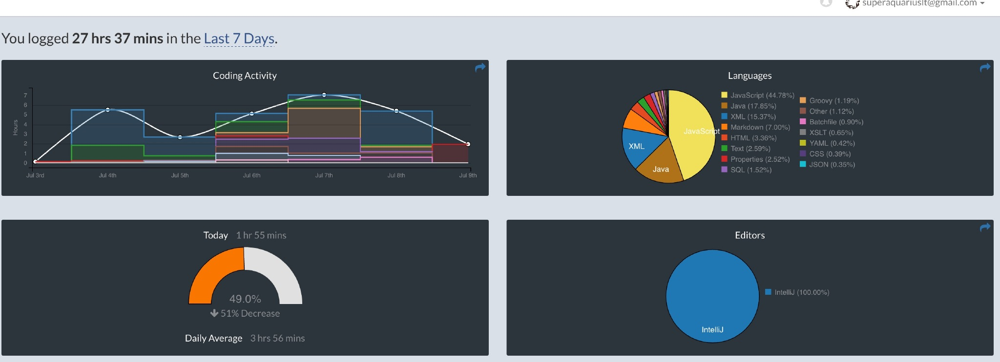

希望在如此好的环境中,学习和工作效率会变得越来越高~
