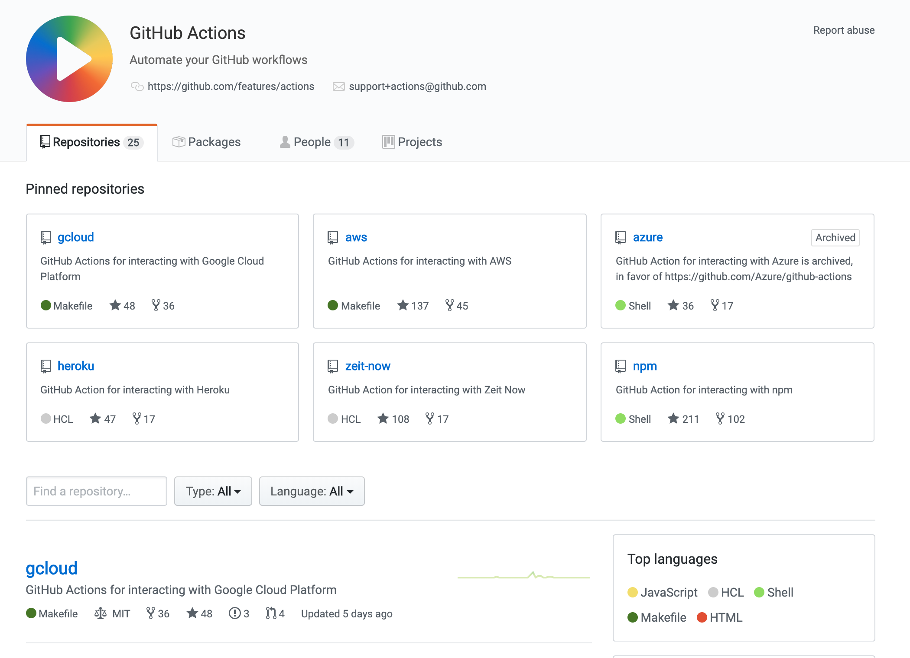
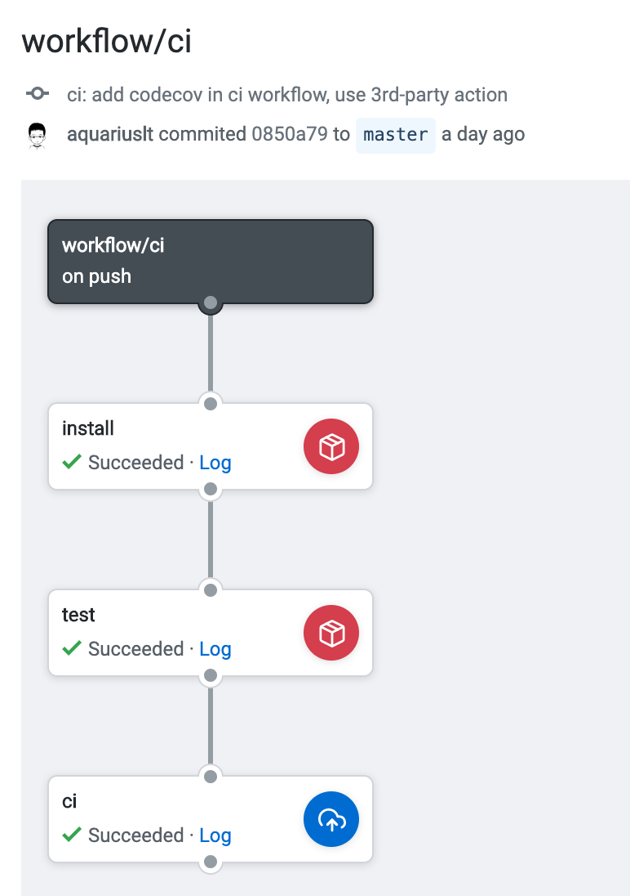
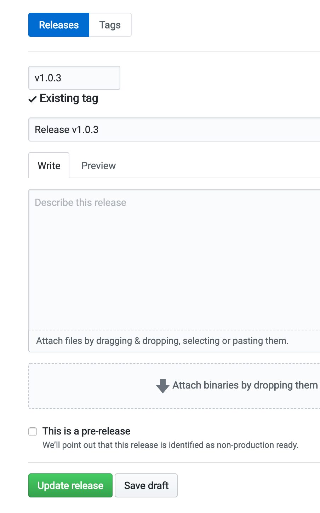
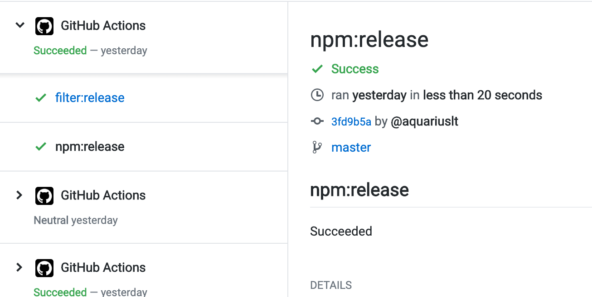

# Github Actions: Overview and Practice

## Background

Github Actions 自从开放 beta 以来，感觉一直没有掀起什么大浪。但是他的在 CI 平台插件方面的概念其实是符合一直以来的方向的: `Docker Image as Plugins`

我在二月份开始已经申请到了 Github Actions Beta 的体验许可，为了体验 Github Actions 的功能，以及跟目前其他开源项目所用的持续集成平台进行简单的对比，下面将以一个 通过 Gtihub Action 发布 npm package 的过程作为初步体验，讲讲我对 Github Actions 在 CI 方面的认识。

## Before Reading

再开始阅读之前，准备了一些截图，简要的从表现上了解下 Github Actions 的一些功能

- What is Github Actions
- How workflow configuration look like
- How workflow runtime look like

### What is Github Actions

Github 官方介绍，简要的将就是 Github 官方提供的 CI 平台，其最大的特点便是插件化形式来进行 CI Stages 的组装。

> GitHub Actions allow you to implement custom logic without having to create an app to perform the task you need. You can combine GitHub Actions to create workflows using an action defined in your repository, a public repository on GitHub, or a published Docker container image. GitHub Actions are customizable and can use the GitHub API and any publicly available third-party APIs to interact with a repository. For example, an action can publish npm modules, send SMS alerts when urgent issues are created, or deploy production ready code. You can discover, create, and share your GitHub Actions with the GitHub community.

先是官方带头在平台基础上创建了一些通用性比较高的、对标其他同类平台的一些主打功能，以一个封装好的 `Actions` 概念暴露出来，然后每个 Repository 便可使用这些官方预设的 `Actions` 来组装自己的 `Workflow` 。

官方 Actions 集合 [https://github.com/actions](https://github.com/actions) 里找到官方维护的 actions. 常见的一些 actions 有:

- npm
- docker
- shell



当然也有很多非官方维护的 Actions，可以通过发布到 Github Marketplace 被查找到，也可以把 Actions 构建成 `docker image` + `entrypoints.sh` 的形式， 在项目 Workflow 的配置文件中以 docker image 路径进行引用。

### How configuration look like

如果有使用过 Travis-CI, CircleCI, Gitlab-CI 的经验，大概可以想起，对应的 CI 配置文件，大都通过 yml 作为基础语法，来描述整个 CI Pipeline 涉及的几个步骤。

在 Github Web 界面中，对一个 Repository 的 Workflow 进行可视化的编辑时，如下图:


实际上他背后也是一个配置文件，用这个配置文件来描述 workflow 的触发条件，步骤，以及每个步骤执行时的参数... 只不过 Github 官方提供了基于这个配置文件的在线可视化编辑，使得编辑过程比较容易直观。

关于配置文件的语法、编写形式，下面会以样例提及。

### How workflow runtime look like

在 Github 界面上查看单个项目的 Workflow 下图这样子:


这个 Workflow 比较直观的表示了一个基本的 `构建-发布` 流程:

1. 在 Github 收到 `push` 事件的时候，触发该 workflow
2. 首先同时执行 `dockerlint` 和 `shelllint` 步骤
3. 以上两步都通过后，根据项目的 dockerfile 构建 docker 镜像
4. 对 docker 镜像进行多次打 Tag (latest, timestamp)，同时判断是否需要进行发布(判断当前分支是否 master 分支)
5. 使用 secrets 进行 docker login 步骤
6. 调用 docker publish 对刚才打过 tag 的镜像 发布到官方的 docker registry 中去

这样一看，对 Github Actions 和 Workflow 的界面表现形式有了一个模糊的了解。基于其他 CI 平台的使用经验，大概可以想象自己目前的 CI Pipeline 转移到 Github Actions 上，表现出来会是怎样一个形式。

## Example Project

现在介绍用来做样例的项目。

这是一个 npm package，已经发布到 npm 上。

npm 地址: [https://www.npmjs.com/package/jest-properties-loader](https://www.npmjs.com/package/jest-properties-loader)

github 地址: [https://github.com/aquariuslt/jest-properties-loader](https://github.com/aquariuslt/jest-properties-loader)

现在我们来了解下:

- 项目目录结构
- 本地发布前、发布时，一般要做什么步骤

接着在下一章介绍，如果通过 Travis-CI 或者 CircleCI 进行 持续构建和自动触发发布，一般的思路和实现方式。

最后再简介如何通过 Github Actions 实现同样的功能。

### Project Overview

这个 npm package 的作用，主要是为 jest 提供一个 `.properties` 文件的 json 格式转换。

不过其实我们不需要了解他的作用，仅仅把他当做一个普通的 public npm package 吧。

项目的文件结构如下:

```
├── LICENSE
├── README.md
├── lib
│   └── index.js
├── package.json
├── test
│   ├── __fixtures__
│   │   └── sample.properties
│   └── loader.test.js
└── yarn.lock
```

### Manual Release Flow

**Running Tests**

当我们准备发布一个新版本时，先通过测试

```bash
yarn test
```

**Build Distribution (Optional)**

如果项目需要构建，则需要有类似 `build` 的一步。

不过这个项目，我直接以可直接运行的 commonjs 的语法进行编写，所以省去了这一步。

Update Version

发布前，我们需要更新仓库版本号，遵循 `semantic versioning` 的原则，进行代码版本号更新。

```bash
yarn version
```

Login NPM

现在一切就绪，我们准备进行 npm package 发布。

一种方式是通过 `npm login` 命令 进行发布, 然后输入 npm 用户名和密码

```bash
npm login
```

当然也有另外一种 npm 推荐的方式，那边是使用使用 NPM 的 [Auth Token](https://docs.npmjs.com/about-authentication-tokens) 进行验证。

参考链接中的步骤创建好一个 Auth Token 后，将其释放在 `.npmrc` 文件内

```bash
export NPM_TOKEN="00000000-0000-0000-0000-000000000000"
echo "//registry.npmjs.org/:_authToken=${NPM_TOKEN}" >> .npmrc
```

参考文章: [https://blog.npmjs.org/post/118393368555/deploying-with-npm-private-modules](https://blog.npmjs.org/post/118393368555/deploying-with-npm-private-modules)

**NPM Publish**

```bash
npm publish
```

至此，我们便手动的将一个 npm package 的新版本发布到 npm registry 了。

## Existing CI CD Flow

现在我们看看如果是 Travis CI 进行自动构建 npm 包发布是怎么做呢

Travis CI 的 Example 样例如下:

```yaml
language: node_js
node_js:
  - '10'

script: npm test

# Submit Coverage Status to coveralls.io
after_script:
  - cat ./test/coverage/lcov.info | ./node_modules/.bin/coveralls

deploy:
  provider: npm
  email: $NPM_AUTH_EMAIL
  api_key: $NPM_AUTH_TOKEN
  on:
    tags: true
    branch: release
```

具体点讲，这份配置文件关于自动发布 npm package 的过程便是

1. 触发条件: 当触发 travis-ci 的 webhooks 是 `tags` 而且 分支名为 `release` 时，触发此 deploy 操作。
2. 使用 travis-ci 提供的 [https://docs.travis-ci.com/user/deployment/npm/](https://docs.travis-ci.com/user/deployment/npm/) `npm release provider` 配合 github secret `$NPM_AUTH_TOKEN` 进行发布。( token 为上一部分介绍的 npm token)

配置过程相当简洁，唯一一点是 npm publish 过程并不透明，我们无法知道 travis ci 的具体实现。

## Introducing Github Actions Solution

现在开始介绍我如何使用 Github Actions 构建一个 workflow，来进行 npm package 的发布。

下面介绍理想中的思路，然后拆分开来讲讲我是如何实现的。

### Release flow design based on Github Actions

在理想的设计里，基本遵循两部分操作:

1. 每次提交代码 (`push event`)，触发基本的 build & test pipeline
2. 每次准备发布新版本的时候，通过 `yarn version` 给即将发布的 npm package 版本迭代版本号，此操作不仅会更新 `package.json` 中的版本，还会给这个更新版本的 commit 自动打上一个 tag
3. 需要发布的时候，在 Repository 的 Github 主页中，从新版本中的 tag 创建一个新的 release。这个 `release event` 会触发 release pipeline，执行发布新版本的操作。

### Create a workflow file

按照 Github Actions 的约定，我们需要在 Repository 根目录的 `.github` 目录下，创建一个 `main.workflow` 文件。Github 将会以 `.github/main.workflow` 作为 workflow 的入口配置文件。

`.workflow` 文件是 Github Workflow 的文件名后缀，其语法为 `hcl` 。

> 2019 年 8 月初, github actions 官方宣布 actions 配置语法会从 HCL 改变为 yaml, 因此这篇文章的 HCL 部分其实在 9 月 30 日之后便失效。后面会更新一篇文章，简述新的 yaml 语法 See [Migrating Github Actions from HCL syntax to YAML syntax](https://help.github.com/en/articles/migrating-github-actions-from-hcl-syntax-to-yaml-syntax)

hcl 全称 **HashiCorp Configuration Language**，其具体的语法规则比较容易明白，实际上可以快速的以 `json`, `yml` 的概念去理解他。

Tips: 如果平时使用 IntelliJ IDEA 进行开发，那么可以通过给 `.workflow` 添加语法支持，将其识别为 `HCL` 语法，即可获得高亮与格式化


为了实现基本操作中的第一部分: 每次提交代码时，触发基本的 build & test pipeline

我在 `main.workflow` 中声明 `build & test` 的 pipeline。

这里为了方便，我使用了 `workflow/ci` 作为他的简称。

```hcl
workflow "workflow/ci" {
  on = "push"
  resolves = ["test"]
}

action "install" {
  uses = "actions/npm@master"
  runs = "yarn"
}

action "test" {
  uses = "actions/npm@master"
  needs = ["install"]
  runs = "yarn"
  args = "test"
}
```

以上代码块，声明了一个 `workflow` 和两个 `actions` 。

以 workflow 作为入口，actions 里的 `resolves` 和 `needs` 作为依赖指向，可以生成有向无环图来描述这个构建流程。

其实际可以理解为：

1. 当触发了 github repository 的 push event 的时候，执行该名为 `workflow/ci` 的 workflow
2. `workflow/ci` 实际上只要执行名为 `test` 的 action，所以会从整个配置文件里，查找 action = `test` 的 action 并执行。
3. 当准备执行 `test` actions 之前，检查他的 `needs` 部分，哦原来执行 `test` 之前，还要先执行一个 `install` 的 action。那么现在需要按顺序执行 `install` `test` 这两个 actions

我们开始看 `install`.

`install` 的内容，便是执行 `yarn` 这个命令，来安装依赖，那么这个 `uses` 何解?

`uses` 实际指向了一个 github actions 的名字，现在名为 `actions/npm@master` ，那么他会从 `[https://github.com/actions/npm](https://github.com/actions/npm)` 的 master 分支下，查找 `Dockerfile` ，构建出一个 docker 镜像，并且使用该 docker 镜像，执行 `runs` 和 `args` 下的命令操作，对工作目录(workspace)进行更变。

说白了，这就是在一个有 `npm` 环境下执行 `yarn` 的一个操作，来安装依赖。

至于如何理解 Github Actions 本身的基础运作，可能需要单独开启一篇进行讲解。

现在再看 `test`

说白了，就是在已安装了 node 依赖的工作目录下，执行 `yarn test` 命令

所以每当触发 Github 的 push event 之后，我们可以在 Github Actions 流程里看到 `workflow/ci` 的执行。



### Add Publish workflow

现在我们来添加一个名为 `release` 的 workflow。在 `main.workflow` 下追加如下内容:

```hcl
workflow "release" {
  on = "release"
  resolves = ["npm:release"]
}

action "filter:release" {
  uses = "actions/bin/filter@master"
  args = "action created*"
}


action "npm:release" {
  needs = "filter:release"
  uses = "actions/npm@master"
  secrets = ["NPM_AUTH_TOKEN"]
  args = "publish"
}
```

里面的内容大概如下:

1. 当收到 github 的 release event 时，触发此操作。(通常是在 Repository 主页的 Release 一栏，创建或更新 新版本 release 时触发的 event)
2. 在执行真正的 npm publish 操作之前，先使用一个名为 `filter: release` 的 action，判断是否真正的需要执行 publish。
3. 我们使用 github 官方的提供的 `actions/npm` ， npm 环境，传入一个 `NPM_AUTH_TOKEN` 的环境变量，然后执行 `npm publish` 命令进行发布。

现在，我们在 github release 页面创建一个新 release 时



将会触发 `npm:release` workflow：



接着可以看到如下 detail log， 详见 [https://github.com/aquariuslt/jest-properties-loader/runs/163050939](https://github.com/aquariuslt/jest-properties-loader/runs/163050939)

```
Successfully built fbc21be41b97
Successfully tagged gcr.io/gct-12-lnx0cl9uvvzo-abntpgke1w/484654f7adf6911ca799c01d40b80af4456b46c3418f33934c643ccc7f245f38/8a5edab282632443219e051e4ade2d1d5bbc671c781051bf1437897cbdfea0f1:fc613b4dfd6736a7bd268c8a0e74ed0d1c04a959f59dd74ef2874983fd443fc9
Already have image (with digest): gcr.io/github-actions-images/action-runner:latest
npm notice
npm notice package: jest-properties-loader@1.0.3
npm notice === Tarball Contents ===
npm notice 764B  package.json
npm notice 1.1kB LICENSE
npm notice 325B  README.md
npm notice 531B  .github/main.workflow
npm notice 200B  lib/index.js
npm notice 15B   test/__fixtures__/sample.properties
npm notice 547B  test/loader.test.js
npm notice === Tarball Details ===
npm notice name:          jest-properties-loader
npm notice version:       1.0.3
npm notice package size:  2.0 kB
npm notice unpacked size: 3.4 kB
npm notice shasum:        dc929c7b12c0bf8e57f100f8cfb95be26fe9464e
npm notice integrity:     sha512-dhmq60thri/8x[...]HG4ITr5zZ8fIw==
npm notice total files:   7
+ jest-properties-loader@1.0.3
npm notice

### SUCCEEDED npm:release 14:18:26Z (16.054s)
```

至此，新版本的 `jest-properties-loader` 已发发布到 npm 中。

**为什么第二步中，我需要做这样一个 filter 呢?**

答: 因为按照 Github 的 event 列表，在 web 页面上创建一个新 release，会同时触发两个 release 事件: `release: created` 和 `release: published` 。当这两个 release 事件都触发这个 workflow 的时候，一旦其中一个 `npm publish` 命令成功发布新版本的包之后， 另外一个在执行发布操作时，就会返回一个 **版本已存在** 的错误，导致整个 commit status 是失败的。

所以我通过 github 官方的 `bin/filter` action 来进行触发事件的过滤，保证同一次界面上的 `release` 操作只会执行一次 `npm publish` .

**为什么在使用 `actions/npm` 时，传递一个 \$NPM_AUTH_TOKEN secret 变量即可进行发布?**

看上去跟之前提及的 "创建好一个 Auth Token 后，将其释放在 `.npmrc` 文件内" 似乎不太一样?

这是因为 `actions/npm` 的 entrypoint.sh 文件，就是做了这样一部环境变量的判断。约定为 `$NPM_AUTH_TOKEN` 时，便将其写入到 `.npmrc` 文件中。

[entrypoints.sh](http://entrypoints.sh) 文件大致如下，详见 [https://github.com/actions/npm/blob/master/entrypoint.sh](https://github.com/actions/npm/blob/master/entrypoint.sh)

```bash
#!/bin/sh

set -e

if [ -n "$NPM_AUTH_TOKEN" ]; then
  # Respect NPM_CONFIG_USERCONFIG if it is provided, default to $HOME/.npmrc
  NPM_CONFIG_USERCONFIG="${NPM_CONFIG_USERCONFIG-"$HOME/.npmrc"}"
  NPM_REGISTRY_URL="${NPM_REGISTRY_URL-registry.npmjs.org}"
  NPM_STRICT_SSL="${NPM_STRICT_SSL-true}"
  NPM_REGISTRY_SCHEME="https"
  if ! $NPM_STRICT_SSL
  then
    NPM_REGISTRY_SCHEME="http"
  fi

  # Allow registry.npmjs.org to be overridden with an environment variable
  printf "//%s/:_authToken=%s\\nregistry=%s\\nstrict-ssl=%s" "$NPM_REGISTRY_URL" "$NPM_AUTH_TOKEN" "${NPM_REGISTRY_SCHEME}://$NPM_REGISTRY_URL" "${NPM_STRICT_SSL}" > "$NPM_CONFIG_USERCONFIG"

  chmod 0600 "$NPM_CONFIG_USERCONFIG"
fi

sh -c "npm $*"
```

## Finally

最后总结，通过本次 Github Actions 的实践，大致了解了:

- Github Actions 的基本概念
- Workflow 的基本组成，配置概念及其运行表象
- Travis CI Pipeline 对应的 Github Actions
- 如何通过 Github Actions 自动发布 NPM Package

## References

- Github Actions Official Document - [https://developer.github.com/actions/](https://developer.github.com/actions/)
- Github Actions Marketplace - [https://github.com/marketplace](https://github.com/marketplace)
- Creating a workflow with github actions - [https://help.github.com/en/articles/creating-a-workflow-with-github-actions](https://help.github.com/en/articles/creating-a-workflow-with-github-actions)

## Further Reading

- Automate your NPM publish with GitHub Actions - [https://medium.com/faun/automate-your-npm-publish-with-github-actions-dfe8059645dd](https://medium.com/faun/automate-your-npm-publish-with-github-actions-dfe8059645dd)
- HCL (HashiCorp Configuration Language) - [https://github.com/hashicorp/hcl](https://github.com/hashicorp/hcl)
