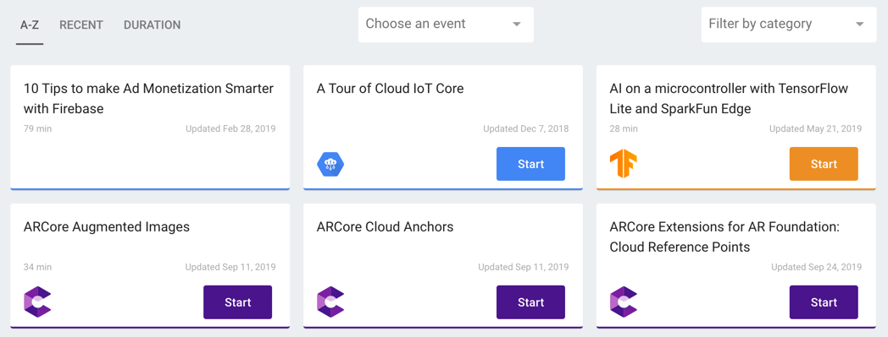

# A beautiful day

This is an example markdown content with all one-pass test cases.

## Getting Started

Getting started snippet

### Installing

```shell script
yarn add -D properteis-json-loader
```

or, using npm

```shell script
npm install --save-dev properties-json-loader
```

### Update webpack configuration

You should use it to load as one of webpack loader configuration matching `*.properties` file.

## Deep Understanding

## References

  

